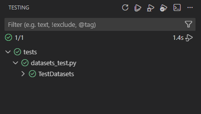

# A Hydra and Pytorch Lightning compatible template for NN development

## Getting started

### Project structure

```sh
.
|-- configs                       # Hydra config files, structured in folders
|   |-- dataset
|   |   |-- sample_dataset.yaml
|   |   `-- ...
|   |-- general.yaml
|   |-- model
|   |   |-- sample_model.yaml
|   |   `-- ...
|   `-- optimizer
|       |-- adam.yaml
|       `-- ...
|
|-- datasets                      # Datasets in torch.nn.Dataset format
|   |-- __init__.py
|   |-- sample_dataset.py
|   `-- ...
|
|-- experiments                   # Results folder (autogenerated at training)
|
|-- models                        # Models in LightningModule format
|   |-- __init__.py
|   |-- sample_model.py
|   `-- ...
|
|-- notebooks                     # Notebook for visualization, eda, etc.
|
|-- scripts                       # Useful scripts (other than train/test)
|   |-- try_hydra.py
|   `-- ...
|
|-- tests
|
|-- utils                         # Useful general utils. Use folders if needed
|   |-- instantiator.py
|   `-- ...
|
|-- requirements.txt
|-- test.py
`-- train.py
```

### Environment setup

Create a virtual environment via Anaconda and install packages from `requirements.txt`. You may use the following commands:

```sh
conda create -n lithydra python=3.12
conda activate lithydra
pip install -r requirements.txt
```

### Hydra configurations

All configuration is handled via Hydra. A config file with general parameters expected to be used throughout all experiments is used (`configs/general.yaml`). For each execution, we have to specify 3 additional configs for:

1. `dataset`. All config files should be in `configs/dataset`.
2. `model`. All config files should be in `configs/model`.
3. `optimizer`. All config files should be in `configs/optimizer`. 

These additional configs should be specified in CLI to be added to general configuration. To do so, use `+<dataset|model|optimizer>=<name>`, as follows:

```sh
... +dataset=sample_dataset +model=sample_model +optimizer=adam
```

You may use `scripts/try_hydra.py` to visualize final config structure:

```sh
python scripts/try_hydra.py +dataset=sample_dataset +model=sample_model ++optimizer=adam
```

### Training 

A `train.py` file is provided for training configuration. To use it, follow the next structure:

```sh
python train.py +dataset=sample_dataset +model=sample_model ++optimizer=adam
```

All logs in training are saved in a centralized W&B project. Access them [here](wandb.ai/tumai-cv4dt). 

### Evaluation

A `eval.py` file is provided for evaluation. To use it, follow the next structure:

```sh
python eval.py +dataset=sample_dataset +model=sample_model ++checkpoint_path=path/to/ckpt.ckpt
```

### Unit tests

Unit tests using `unittest` package from Python is used. We recommend using `unittest` integration with VS Code to use them. Follow instructions [here](https://code.visualstudio.com/docs/python/testing). You should get a panel like this:



If you can't use the previous approach, you may also run tests with the following command:

```sh
python -m unittest path/to/test.py
```

### Summary

The most basic commands to use are:

```py
python train.py ... # training script. see example in next section
python test.py ... # testing script. see example in next section
python scripts/try_hydra.py ... # see example in next section
```